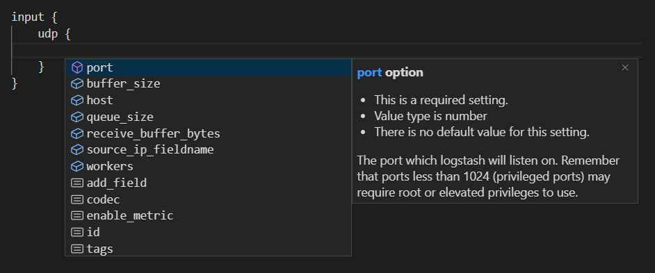

# VSCode Logstash Editor

Visual Studio Code extension that provides completion and documentation for Logstash pipeline configuration files.



[Project Page](https://github.com/fbaligand/vscode-logstash-editor)  
[Change Log](https://github.com/randomchance/vscode-logstash-configuration-syntax/blob/master/CHANGELOG.md)


## Features

- Provides completion for Logstash pipeline configuration files (sections, plugins, options), depending current cursor position.  
For example, if cursor is inside `grok` filter, options for `grok` filter are suggested.
- All completion data is generated from official Logstash documentation (Logstash 7.2 at this time)
- Options for a plugin are sorted : first required options, then optional specific options, and finally optional common options
- When you preselect an item, a link to official documentation, a short description and an example (if available) are provided
- If you choose a completion item, a code snippet is automatically inserted with relevant content :
  - for a plugin, inserted snippet is the plugin block and all its required options
  - for an option, inserted snippet is based on option type (string, boolean, number, string_duration, array, hash)
- Provides documentation when hover on a section, a plugin or an option
- Automatically detects files that match:
  - `*logstash.conf`
  - `*logstash.conf.j2`
  - `*logstash.conf.template`
  - `logstash-*.conf`


## Important note

For now, only this format style is supported:
``` ruby
filter {
	tcp {
		port => 12345
	}
}
```

This format style is not supported:
``` ruby
filter 
{
	tcp 
	{
		port => 12345
	}
}
```

Neither this one:
``` ruby
filter { tcp { port => 12345 } }
```
